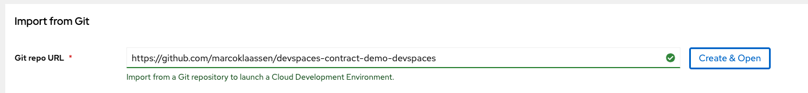
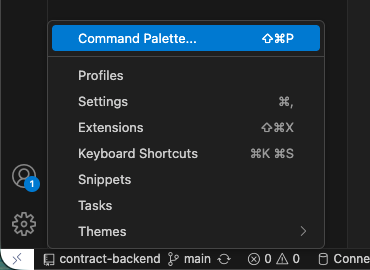
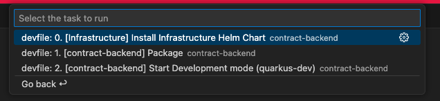
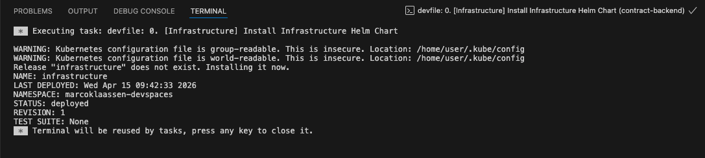
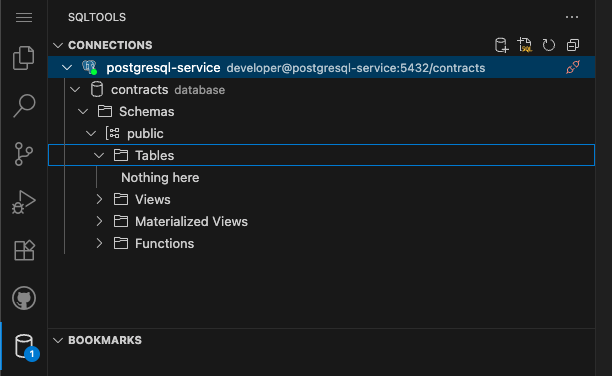

# Dev Spaces Demo for real world applications

This Dev Spaces Demo demonstrates how to develop an application which has different dependencies while developing it locally. 
Of course - as application developers - we would like to have isolated microservices which are designed to be developed without any related infrastructure. 
The goal is to write unit tests, integration tests and e2e tests so you don't need any additional components deployed to just develop the simple microservice on your local machine. 

But in reality we see a lot of legacy applications with dependencies to different components. And often it's not possible to test one component locally without having other components available. This is the reason why I created this demo to show that it's possible to solve this scenario in OpenShift Dev Spaces as well. 

So you are able to develop your application fully containerized in a standardized and secure environment. 
And this is a very good first step to modernize the application and decouple components for the future. 

## Demo Application's Architecture

This is the entry point for a demo with several repositories involved: 
* [Root Repo / This Repo](https://github.com/marcoklaassen/devspaces-contract-demo-devspaces)
 * [Infrastructure (Database, Kafka)](https://github.com/marcoklaassen/devspaces-contract-demo-infrastructure)
 * [Backend Application (Contract Backend)](https://github.com/marcoklaassen/devspaces-contract-demo-backend)
 * [External API (Customer Backend)](https://github.com/marcoklaassen/devspaces-contract-demo-customer-api)


```
 external component outside        │     The component              │       Components I want  
 my devspaces namespace                I want to work on                    to start during    
                                   │                                │       local development  
─ ─ ─ ─ ─ ─ ─ ─ ─ ─ ─ ─ ─ ─ ─ ─ ─ ─ ─ ─ ─ ─ ─ ─ ─ ─ ─ ─ ─ ─ ─ ─ ─ ─ ─ ─ ─ ─ ─ ─ ─ ─ ─ ─ ─ ─ ─ ─
                                   │                                │                          
                                                                                               
   ┌────────────────┐              │                                │                          
   │Customer Backend│                               persist new contract    ┌─────────────────┐
   │ -external API- │              │          ┌─────────────────────│───────┤Contract Database│
   └───────┬────────┘                         │                             └─────────────────┘
           │                       │          │                     │                          
           │                                  │                                                
           │   ask if customer     │ ┌────────┴───────┐             │                          
           └─────────────────────────┤Contract Backend│                                        
               already exists      │ └────────┬───────┘             │                          
                                              │                                                
                                   │          │                     │                          
                                              │                                                
                                   │          │                     │                          
                                              │                            ┌────────────────┐  
                                   │          │                     │      │Kafka           │  
                                              └────────────────────────────┤                │  
                                   │             consume new        │      │Topic: Contracts│  
                                                 contract event            └───────┬────────┘  
                                   │                                │              │           
                                                                                   │           
                                   │                                │              │produce    
                                                                                   │new        
                                   │                                │              │contract   
                                                                                   │           
                                   │                                │     ┌────────┴────────┐  
                                                                          │Customer Frontend│  
                                   │                                │     └─────────────────┘  
```

## DevSpaces Demo Parts 

* custom Universal Developer Image 
 * update Java Version
 * install quarkus cli
* Devfile integration
* Default Extensions incl. configuration of database connection

## Prerequisites

* OpenShift DevSpaces Operator
* OpenShift Pipelines Operator
* Streams for Apache Kafka Operator

## Configuration of Dev Spaces

### Enable Public Extension Registry

`oc edit checluster devspaces -n <devspaces_namespace>` (usually openshift-operators)

Update the openVSXURL: Locate the spec.components.pluginRegistry section and set the openVSXURL field to the public registry URL.

```bash
spec:
  components:
    pluginRegistry:
      # ... other settings ...
      openVSXURL: 'https://open-vsx.org'  # <-- Change this

```

### Configure Git & VSCode Editor

```bash
oc apply -f gitconfig-configmap.yaml
oc apply -f vscode-editor-configurations.yaml 

```

### Configure Github Oauth

```bash
# https://docs.redhat.com/en/documentation/red_hat_openshift_dev_spaces/3.27/html/administration_guide/assembly_configuring-oauth-for-git-providers_administration_guide#proc_setting-up-the-github-oauth-app_administration_guide
oc apply -f github-secret.yaml -n openshift-operators
```

### Configure OpenShift Pipelines 

To access the UDI base image the pipeline service account must have access to registry.redhat.io. 
And to push the image to the quay.io repository the service account must also have access to the repository. 

```bash
# usually done in the <username>-devspaces namespace
oc create secret generic container-registry-credentials --from-file=.dockerconfigjson=<path-to-your-dockerconfig.json> --type=kubernetes.io/dockerconfigjson
oc secret link pipeline container-registry-credentials                                                   
oc secret link pipeline container-registry-credentials --for pull
```

## Demo

### Start the Developer Environment 

Open the Dev Spaces Dashboard and `Create & Open` the GitHub Repo:



The Devfile will be applied and your IDE will be prepared for you. 

### Install the application's dependencies

To open the application's dependencies execute the prepared command: `Run Task -> Devfile -> 0. [Infrastructure] ...`







You can also check if the database (which is provisioned by the infrastructure helm chart) is available. The `vscode-editor-configurations.yaml` already installed and configured the SQLTools for you: 



The second check you should to is about the kafka infrastructure. Open a new terminal in your IDE and check the deployment: 

Containers are running ☑️
```bash
contract-backend (main) $ oc get pods
NAME                                         READY   STATUS    RESTARTS   AGE
kafka-broker-0                               1/1     Running   0          5m9s
kafka-broker-1                               1/1     Running   0          5m9s
kafka-broker-2                               1/1     Running   0          5m9s
kafka-controller-3                           1/1     Running   0          5m8s
kafka-controller-4                           1/1     Running   0          5m8s
kafka-controller-5                           1/1     Running   0          5m8s
kafka-entity-operator-686c48986c-pqcrq       2/2     Running   0          2m23s
postgresql-7cfd947f67-fcwkv                  1/1     Running   0          5m13s
workspace1ea012ac59bf4f86-79dd7c5485-725vv   2/2     Running   0          17m
```

Kafka Cluster ready ☑️
```bash
contract-backend (main) $ oc get kafka
NAME    READY   METADATA STATE   WARNINGS
kafka   True    KRaft            
```

Kafka Topic ready ☑️
```bash
contract-backend (main) $ oc get kafkatopics.kafka.strimzi.io 
NAME       CLUSTER   PARTITIONS   REPLICATION FACTOR   READY
contract   kafka     1            1                    True
```


Kafka User ready ☑️
```bash
contract-backend (main) $ oc get kafkausers.kafka.strimzi.io 
NAME              CLUSTER   AUTHENTICATION   AUTHORIZATION   READY
kafka-developer   kafka     scram-sha-512    simple          True
```

### Run our backend

No we want to implement new features to our contract backend.
We have to make sure that we can run and test our backend in our IDE first. Execute the devfile command like you did to install the infrastructure components - but this time use the command: `2. [contract-backend] Start Development mode (quarkus-dev)`

This command will set the environment variables you need to access the infrastructure and start the the quarkus backend with `quarkus dev`.

In the logs you can see that the database was initialized: 

```bash
[Hibernate] 
    set client_min_messages = WARNING
[Hibernate] 
    drop table if exists Contract cascade
[Hibernate] 
    drop sequence if exists Contract_SEQ
[Hibernate] 
    create sequence Contract_SEQ start with 1 increment by 50
[Hibernate] 
    create table Contract (
        firstContractOfCustomer boolean,
        id bigint not null,
        customer varchar(40),
        type varchar(40),
        primary key (id)
    )

[Hibernate] INSERT INTO "contract"(id, "type", customer, firstContractOfCustomer) VALUES (1, 'health', 'Marco', true)
[Hibernate] INSERT INTO "contract"(id, "type", customer, firstContractOfCustomer) VALUES (2, 'car', 'John', true)
[Hibernate] ALTER SEQUENCE contract_seq RESTART WITH 3
```

And you can also check if the connection to the kafka topic was sucessfull: 

```bash
INFO  [io.sma.rea.mes.kafka] (Quarkus Main Thread) SRMSG18229: Configured topics for channel 'contract': [contract]

INFO  [org.apa.kaf.com.sec.aut.AbstractLogin] (smallrye-kafka-consumer-thread-0) Successfully logged in.
```

By executing `curl localhost:8080/contract` you can also confirm that the API works as expected and the database connection is ready:

```bash
[{"id":2,"type":"car","customer":"John","firstContractOfCustomer":true},{"id":1,"type":"health","customer":"Marco","firstContractOfCustomer":true}]`
```

Now you can start extending new features to or fixing bugs in your contract backend and test them *locally* (in your hosted IDE). Get get here you didn't have to configure an IDE or your local machine. Everything was done for you by the combination of DevSpaces default configuration and Devfile *magic*. 

### Deploy customer api

For this demo we decided to look at the *customer api* as an external service which is deployed somewhere else - not in our namespace, maybe outside of our OpenShift environment. 
We should look at this service as something we don't have under control. 

But to prepare the demo you have to make sure that this application is living somewhere. For that reason the following lines will tell you how to deploy the *customer api*. 

```bash
oc new-project customer-api
oc project customer-api 
cd ../customer-api/helm/customer-api/
helm install customer-api .
```

By creating a new contract in our *contract backend* we ask the *customer api* if the customer already exists

```bash
curl -X POST http://localhost:8080/contract -H "Content-Type: application/json" -d '{"type": "car", "customer": "Hawkeye"}'
```

So we'll know if the API is up and running. Alternatively we can also check this with 

```bash
curl https://customer-api-customer-api.apps.ocp4.klaassen.click/customer
```

which should return something like: 

```bash
[{"id":1,"name":"Marco"},{"id":2,"name":"John"}]
```

How does our *contract backend* know about the *customer api*? In `devfile.yaml` we defined an environment variable `QUARKUS_CUSTOMER_API_URL`. This environment variable is used in the `properties.yaml` of our *contract backend* to configure the API client. 

### Test application with Kafka Message

The *contract backend* is designed to receive a new contract through a Kafka topic. After receiving the new contract it asks *customer api* if customer already exists and sets contract's field if it's a new customer or an existing one. To test this end-to-end process there is a `trigger-kafka-producer.sh` script. 

You can run the script like 

```bash
./trigger-kafka-producer.sh '{"type":"car","customer":"felix"}'
```

to produce a new contract. Logs should look like this: 

```bash
INFO  [org.acm.ContractResource] (vert.x-worker-thread-1) Customer felix already exists. Setting firstContractOfCustomer to false.
```

## Universal Developer Image

This section describes how to customize and build the universal developer image. 

First you have to change / customize your `Containerfile.custom-udi`. 
After you added new features / tools (like adding cli tools, installing new frameworks, upgrading quarkus, ...) commit and push these changes. 

```bash
git status
On branch main
Your branch is up to date with 'origin/main'.

Changes not staged for commit:
  (use "git add <file>..." to update what will be committed)
  (use "git restore <file>..." to discard changes in working directory)
        modified:   universal-developer-image/Containerfile.custom-udi
```

Now create the pipeline and a pipeline-run in OpenShift:

```bash
oc project marcoklaassen-devspaces 
oc apply -f universal-developer-image/custom-udi-pipeline.yaml 
# pipeline.tekton.dev/custom-udi-pipeline created

oc create -f universal-developer-image/custom-udi-pipeline-run.yaml 
# pipelinerun.tekton.dev/custom-udi-pipeline-<id> created
```

After pipeline finished the new version of the UDI is available in your container image repository. 

## The secure way to run nested containers in OpenShift Dev Spaces

[Enable container run capabilities](https://docs.redhat.com/en/documentation/red_hat_openshift_dev_spaces/3.27/html/administration_guide/assembly_configuring-workspaces-globally_administration_guide#proc_enabling-container-run-capabilities_administration_guide) 

```bash
oc patch checluster/devspaces -n openshift-devspaces \
  --type='merge' -p \
  '{"spec":{"devEnvironments":{"disableContainerRunCapabilities":false}}}'
```

And see: 

```bash
contract-backend (main) $ cat /etc/passwd
  root:x:0:0:root:/root:/bin/bash
  [...]
  user:x:1000:1000::/home/user:/bin/bash

contract-backend (main) $ podman run -d --name security-test alpine sleep 9999

# When you ran podman exec security-test id, the process shouted: "I am root (0)!"
contract-backend (main) $ podman exec security-test id
  uid=0(root) gid=0(root) groups=0(root),1(bin),2(daemon),3(sys),4(adm),6(disk),10(wheel),11(floppy),20(dialout),26(tape),27(video)

# But when you ran ps -ef | grep sleep, you saw it was owned by user (which corresponds to your account 1000 in that environment).
contract-backend (main) $ ps -ef | grep sleep
  user        2161    2159  0 13:50 ?        00:00:00 sleep 9999
  user        2314    1581  0 13:51 pts/0    00:00:00 grep --color=auto sleep

contract-backend (main) $ podman unshare cat /proc/self/uid_map
         0       1000          1
         1       1001      64535
```

* The Root Trap: Inside the nested container, UID 0 (root) is mapped to UID 1000 in your DevSpaces pod.
* The Rest: Any other user inside Podman (UID 1 through 64535) is mapped to UIDs starting at 1001 and up in your DevSpaces pod.
* The process is actually restricted. 
* If that sleep process tried to reach out and touch a file on your DevSpaces disk owned by "real" root, the Linux kernel would look at the map, see that the process is actually just 1000, and say "Access Denied."

As soon as we revert the change 
```bash
oc patch checluster/devspaces -n openshift-devspaces \
  --type='merge' -p \
  '{"spec":{"devEnvironments":{"disableContainerRunCapabilities":true}}}'
```

our nested container approach would look like this (it'll fail):

```bash
# user ID is now 1000780000. This is a standard, restricted OpenShift UID
contract-backend (main) $ cat /etc/passwd
root:x:0:0:root:/root:/bin/bash
[...]
user:x:1000780000:0::/home/user:/bin/bash

contract-backend (main) $ podman run -d --name security-test alpine sleep 9999
Resolved "alpine" as an alias (/etc/containers/registries.conf.d/000-shortnames.conf)
Trying to pull docker.io/library/alpine:latest...
Getting image source signatures
Copying blob 6a0ac1617861 done   | 
Copying config 3cb067eab6 done   | 
Writing manifest to image destination
Error: pasta failed with exit code 1:
Failed to open() /dev/net/tun: No such file or directory
Failed to set up tap device in namespace
```